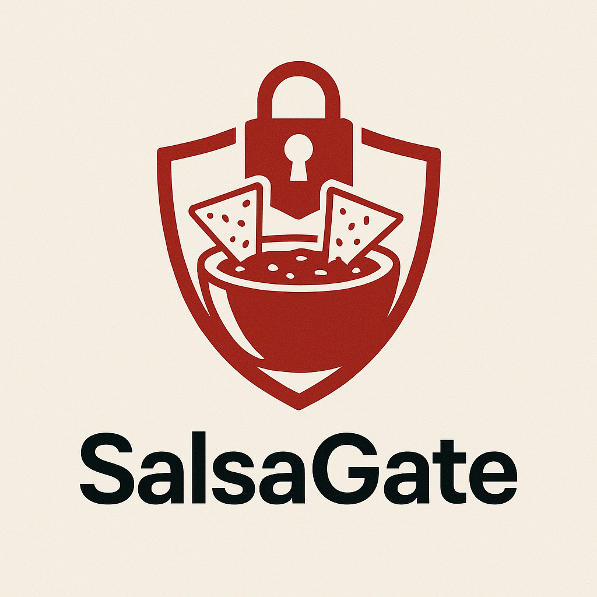
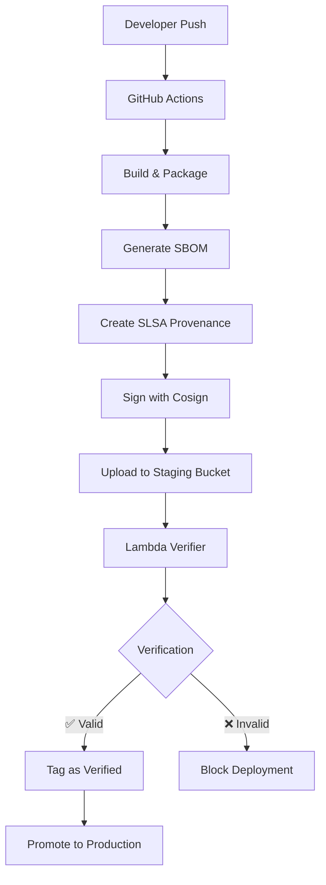

# SalsaGate Trust Pipeline



This repo demonstrates end-to-end artifact trust for a static site using
Sigstore `cosign`, SLSA provenance, a staging bucket, and an optional
verifier Lambda.

## 🔒 Supply Chain Security Features

- **Cryptographic Signing**: All artifacts signed with Sigstore cosign
- **SLSA Provenance**: Build attestations proving artifact integrity  
- **SBOM Generation**: Software Bill of Materials for dependency tracking
- **Zero-Trust Deployment**: Only verified artifacts can reach production
- **Tamper Detection**: Automatic verification prevents compromised deployments

## Architecture Overview



## One-time AWS setup

1. Create two S3 buckets:
   - `STAGING_BUCKET` – temporary storage for build outputs.
   - `WEBSITE_BUCKET` – public site bucket.
2. Apply the policy in [`infra/bucket-policy-website.json`](infra/bucket-policy-website.json)
   to the website bucket so only objects tagged `trust=verified` can be uploaded.
3. Create an IAM role using [`infra/iam-gha-oidc-role.json`](infra/iam-gha-oidc-role.json)
   and note the ARN for `ROLE_ARN`.
4. *(Optional)* Create a DynamoDB table for the ledger and deploy the Lambda
   container in [`trust-service`](trust-service). Add an S3 trigger or Lambda URL
   and use [`infra/eventbridge-s3-notification.json`](infra/eventbridge-s3-notification.json)
   if you want automatic verification on upload.

Replace the TODO placeholders (`<REPLACE_ME>`, `<ACCOUNT_ID>`) in the workflows
and infra snippets with your actual values.

## Workflows

### 01-build-attest
Triggered on pushes to `main`.
1. Builds a tarball `site-<sha>.tgz` (creates a placeholder `dist/index.html` if
   nothing exists).
2. Generates an SPDX JSON SBOM.
3. Writes a minimal SLSA predicate `provenance.json`.
4. Installs cosign and signs/attests the tarball using blob commands.
5. Uploads the tarball, signature, certificate, attestation bundle, SBOM, and
   provenance file to the staging bucket.

### 02-verify-promote
Manual `workflow_dispatch` with `object_key` input (e.g., `site-<sha>.tgz`).
1. Downloads the artifact bundle from staging.
2. Verifies the signature and SLSA attestation with cosign blob commands.
3. If `promote` is `true`, copies the tarball to the website bucket with the
   tag `trust=verified` so the bucket policy permits it.

## Trust Service (Lambda Verifier)

The optional Lambda function in [`trust-service/`](trust-service/) provides automatic verification:

### Features
- **Automatic Verification**: Triggers on S3 uploads to staging bucket
- **Cosign Integration**: Verifies signatures and SLSA attestations
- **Audit Trail**: Logs all verification attempts to DynamoDB
- **Auto-Promotion**: Can automatically promote verified artifacts
- **Container Deployment**: Includes cosign binary for Lambda execution

### Deployment
```bash
# Build container
docker build -t trust-verifier trust-service/

# Deploy to Lambda (requires ECR setup)
# See trust-service/README.md for detailed instructions
```

### Environment Variables
- `LEDGER_TABLE` - DynamoDB table for audit trail
- `WEBSITE_BUCKET` - Target bucket for auto-promotion
- `OIDC_ISSUER` - GitHub OIDC issuer (default: token.actions.githubusercontent.com)

## Integration Example: MICS295Capstone

This trust pipeline has been successfully integrated into the [MICS295Capstone](../MICS295Capstone/) project, demonstrating real-world application:

### Integration Highlights
- **Existing CI/CD Enhanced**: Added trust pipeline to existing GitHub Actions workflow
- **Backward Compatibility**: Maintains existing CodePipeline while adding security
- **Zero-Trust Deployment**: S3 bucket policy enforces verification requirements
- **Automatic Verification**: Lambda function verifies all uploaded artifacts

### Modified Workflow
The integrated workflow in MICS295Capstone performs:
1. **Build Phase**: Creates `dist/` with `index.html`, packages as tarball
2. **Trust Phase**: Generates SBOM, SLSA provenance, signs with cosign
3. **Upload Phase**: Uploads signed artifacts to staging bucket
4. **Verification Phase**: Lambda automatically verifies and promotes
5. **Legacy Phase**: Maintains existing CodePipeline for compatibility

## Signed Artifacts

Each build produces the following cryptographically signed artifacts:

```
site-<commit-sha>.tgz                    # Website tarball
site-<commit-sha>.tgz.sig                # Cryptographic signature
site-<commit-sha>.tgz.pem                # X.509 certificate
site-<commit-sha>.tgz.attestation.sigstore # SLSA attestation bundle
sbom-<commit-sha>.spdx.json              # Software Bill of Materials
provenance.json                          # Build provenance metadata
```

## Verification Process

### Manual Verification
```bash
# Download artifacts
aws s3 cp s3://staging-bucket/site-<sha>.tgz .
aws s3 cp s3://staging-bucket/site-<sha>.tgz.sig .
aws s3 cp s3://staging-bucket/site-<sha>.tgz.pem .

# Verify signature
cosign verify-blob \
  --certificate-oidc-issuer https://token.actions.githubusercontent.com \
  --certificate-identity-regexp "https://github.com/.+" \
  --signature site-<sha>.tgz.sig \
  --certificate site-<sha>.tgz.pem \
  site-<sha>.tgz

# Verify attestation
cosign verify-blob-attestation \
  --type slsaprovenance \
  --certificate-oidc-issuer https://token.actions.githubusercontent.com \
  --certificate-identity-regexp "https://github.com/.+" \
  --bundle site-<sha>.tgz.attestation.sigstore \
  site-<sha>.tgz
```

### Automatic Verification (Lambda)
The Lambda function performs the same verification automatically and:
- Tags verified artifacts with `trust=verified`
- Logs results to DynamoDB audit table
- Optionally promotes to production bucket
- Blocks tampered or invalid artifacts

## Security Guarantees

### 🔐 Cryptographic Verification
- **Digital Signatures**: Every artifact cryptographically signed
- **Certificate Transparency**: Signatures logged in Sigstore transparency log
- **Identity Verification**: Proves artifacts built by your GitHub repository
- **Tamper Detection**: Any modification invalidates signature

### 📋 Supply Chain Attestation
- **SLSA Provenance**: Cryptographic proof of build process
- **SBOM**: Complete inventory of all components and dependencies
- **Build Reproducibility**: Verifiable build environment and process
- **Audit Trail**: Immutable log of all verification attempts

### 🚫 Zero-Trust Deployment
- **Bucket Policy Enforcement**: AWS S3 blocks unverified uploads
- **No Human Override**: Cannot bypass verification process
- **Fail-Safe**: System fails secure if verification fails
- **Continuous Monitoring**: Real-time verification of all deployments

## Notes

- The workflows deliberately use `cosign` **blob** subcommands instead of image
  commands to avoid Docker Hub authentication issues.
- You can swap the manual `provenance.json` step with
  [`actions/attest-build-provenance@v1`](https://github.com/actions/attest-build-provenance)
  if you prefer a richer SLSA provenance.
- All AWS access uses OIDC; no long-lived credentials are stored in GitHub.
- The Lambda verifier requires container deployment to include the cosign binary.

## File Structure

```
├── .github/workflows/
│   ├── 01-build-attest.yml        # Build and sign artifacts
│   └── 02-verify-promote.yml      # Verify and promote to production
├── infra/
│   ├── bucket-policy-website.json # Zero-trust S3 bucket policy
│   ├── iam-gha-oidc-role.json     # GitHub OIDC IAM role
│   └── eventbridge-s3-notification.json # S3 event configuration
├── trust-service/
│   ├── handler.py                 # Lambda verification function
│   ├── Dockerfile                 # Container with cosign binary
│   └── requirements.txt           # Python dependencies
├── images/
│   └── logo1.png                  # Project logo
└── README.md                      # This file
```

## Getting Started

1. **Fork this repository**
2. **Set up AWS infrastructure** using templates in `infra/`
3. **Update placeholders** in workflow files with your AWS details
4. **Deploy Lambda verifier** (optional) for automatic verification
5. **Push to main branch** - trust pipeline activates!

Your artifacts are now cryptographically signed and verified! 🔒

## Real-World Usage

See the [MICS295Capstone integration](../MICS295Capstone/) for a complete example of how to integrate this trust pipeline into an existing CI/CD workflow while maintaining backward compatibility.
